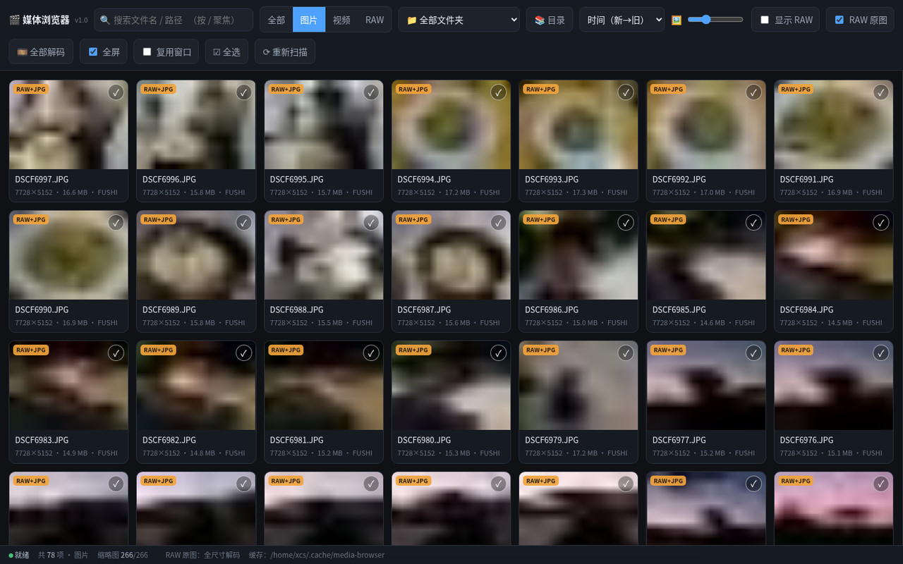
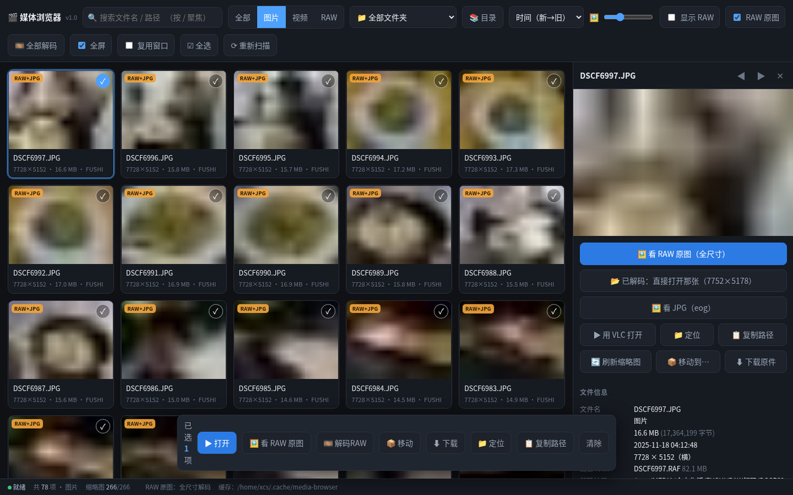
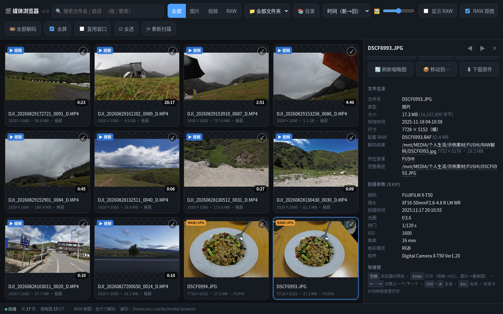
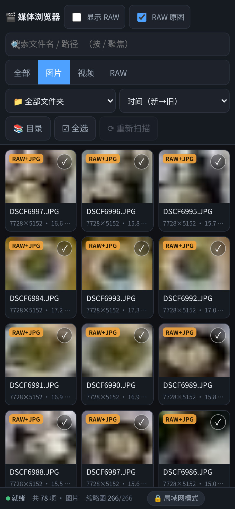
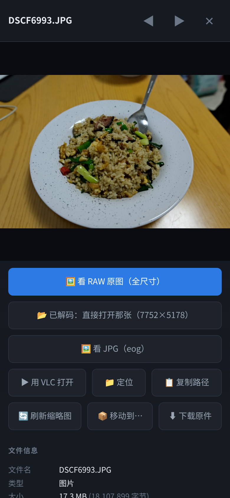
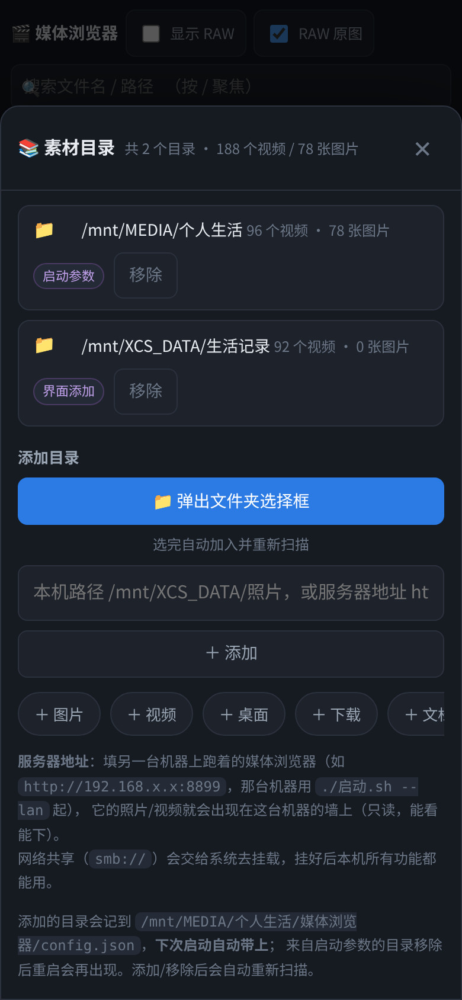

# 媒体浏览器 Media Browser

> 把任意文件夹里的图片和视频铺成一堵**缩略图墙**：**视频交给本机 VLC、图片看原图、富士 RAW 解全尺寸**，
> 顺便把整个素材库只读地借给手机和局域网里的其它电脑（能看、能播、能批量下载）。
> 后端单文件 Python 标准库，前端单文件 HTML，无第三方依赖 —— Linux / macOS / Windows 通用。



一个**本机小工具**：把某个文件夹里所有的图片和视频铺成一堵**缩略图墙**，
点开就能看详情（尺寸 / 时长 / 编码 / EXIF / 路径）；
**视频一键交给本机 VLC 播放，图片交给本机看图工具看原图（有 RAW 就直接解 RAW 全尺寸）**。

- 工程目录：`/data/Projects/媒体浏览器/`
- 桌面图标：`~/桌面/媒体浏览器.desktop` —— **双击一键启动**（应用菜单里也注册了一份）
- 当前素材量下（96 个视频 + 78 张照片 + 78 个 RAW），首次扫描约 0.2 秒，缩略图 174 张全部生成约 25 秒（之后秒开）
- 界面里可以直接**加别的文件夹**（系统选择框或手输路径），加了会记住，下次启动还在
- 富士 `.RAF` 能**解出 40MP 全尺寸原图**来看（不是那张缩小的内嵌预览）
- 只监听 `127.0.0.1`，纯本机使用；除 Python 标准库外无强制依赖
- **同一套代码在 Linux / macOS / Windows 上都能跑**，会自动挑那台机器上现成的系统工具
  （macOS 用自带的 `sips`/`qlmanage`/`mdls`，Windows 用 PowerShell 的 .NET；没有 ffmpeg / Pillow 也能跑，只是相应功能降级）
- 素材目录除了**本机文件夹**，还可以填**另一台机器上跑着的媒体浏览器地址**（`http://192.168.x.x:8899`），
  两台的素材会合在一堵墙上（远程只读：能看、能播、能下载）
- 手机上看是专门调过的：三列缩略图、整屏详情、按钮加大，适合躺床上翻照片

---

## 界面速览

### 桌面：缩略图墙 + 详情面板

| 缩略图墙 | 详情面板（大小 · 修改时间 · 尺寸；EXIF 与完整路径见下面那张） |
| --- | --- |
|  |  |

- 卡片角上直接标出 `视频` / `RAW+JPG`，视频带时长；图下面一行是 `尺寸 · 大小 · 所在文件夹`
- 顶部一排：搜索、类型（全部 / 图片 / 视频 / RAW）、按文件夹筛选、排序、缩略图大小、显示 RAW、RAW 原图
- **双击卡片按类型分流**：视频 → 本机 VLC；图片 → 本机看图工具看原图
- 详情里视频还能「🖥 浏览器内预览」（HEVC 自动转码），图片能直接跳到原图 / RAW

### 富士 RAW：解出全尺寸再看



- 有配套 `.RAF` 的照片会标 `RAW+JPG`，详情里三档随便挑：
  **🖼 看 RAW 原图（全尺寸）** / **📂 已解码：直接打开那张** / **🖼 看 JPG**
- 也可以「🎞 全部解码」按当前筛选批量解，解出来的图放在照片同级的 `RAW解码/` 文件夹里
  （不是内嵌那张缩小的预览，是 7752×5178 的真·全尺寸）

### 手机：竖屏三列，点开就是整屏

| 缩略图墙 | 整屏详情 | 目录（本机文件夹 + 服务器地址） |
| --- | --- | --- |
|  |  |  |

- 手机上一屏三列，点缩略图右上角 ✓ 加选，点卡片直接进整屏详情，按钮都按手指尺寸放大
- 局域网访问时**弹本机程序 / 移动文件**一律禁用；HEVC / 4K 视频由服务端实时转码后在页面里播
- 目录窗口里除了本机路径，还能填**另一台机器的媒体浏览器地址**（`http://192.168.x.x:8899`），
  两台的素材合并成一堵墙，能看能下

> 截图用的是一组**示例素材**（风景、静物，**不含人物**）—— 你自己用起来就是自己的文件夹、自己的文件名。
> 手机那两张是**局域网客户端**视角，所以底栏有「🔒 局域网模式」、没有「全部解码 / 移动」这类只在本机做的操作。

---

## 一、快速开始

**最省事的用法：双击桌面上的「媒体浏览器」图标。**

图标走的是 `启动-静默.sh`：**后台起服务、不弹终端窗口**，起好后在右上角弹一条桌面通知
（本机地址 + 手机地址），浏览器自动打开。已经在跑的时候再点，它只会把浏览器叫到前台，
不会起第二个实例。想看扫描日志就用 `./启动.sh`，或应用菜单里的「媒体浏览器（带日志窗口）」。

命令行方式：

```bash
cd /data/Projects/媒体浏览器
./启动.sh                     # 不带参数：自动挑存在且有内容的素材目录（见下面的说明）
./启动.sh ~/Pictures          # 浏览指定目录
./启动.sh ~/A ~/B             # 浏览多个目录
./启动.sh --lan               # 顺便开放局域网：手机 / 别的电脑也能看（只读）
MEDIA_BROWSER_LAN=1 ./启动.sh # 同上，用环境变量写法
./启动.sh --lan --token 我的口令   # 局域网里也想能点「打开/播放」（口令自己定）
```

**不带参数时会自动挑目录**（`启动.py` 里的候选表，只取**存在且里面有东西**的）：
Linux 依次看 `/mnt/MEDIA/个人生活` → `/mnt/MEDIA` → `/mnt/XCS_DATA/生活记录` → `~/图片`，最多 3 个；
一个都没有才退到家目录。外接盘没挂上时不会报「目录不存在」，直接跳过 —— 想让它出现就先挂上盘，
或者在界面里「📚 目录」加一次（会记住）。

> `启动.sh` 会把选项和目录分开处理，`--lan`、`--token 口令`、`--warmup none` 这类
> 选项不会被当成目录去检查，原样转给 `media_browser.py`。

> 现在有两种加目录的方式：启动时用参数（上面的写法），或者直接在界面点 **「📚 目录」**
> ——后者会在 `config.json` 里记一笔，**下次启动不用再敲路径**。

也可以双击工具目录里的 **`媒体浏览器.desktop`**（或在终端里）：

```bash
python3 media_browser.py /mnt/MEDIA/个人生活
```

启动后终端会打印地址（默认 <http://127.0.0.1:8777/>），浏览器会自动打开。
**停止服务：在终端按 `Ctrl+C`。**

> 已经在运行时再点一次桌面图标，不会起第二个实例 —— 脚本会认出服务在跑，
> 直接把浏览器窗口叫到前台。换端口用环境变量：`MEDIA_BROWSER_PORT=8899 ./启动.sh`。

> 端口被占用时换个端口：`python3 media_browser.py /mnt/MEDIA/个人生活 -p 8899`

### 同一套代码，三个平台怎么起

`media_browser.py` 的干活逻辑三平台共用，启动入口各留一个，**双击就行**：

| 平台 | 双击这个 | 等价的命令行 | 说明 |
| --- | --- | --- | --- |
| Linux | 桌面「媒体浏览器」图标 | `./启动.sh` | zenity 选文件夹、`gio` 定位、VLC 播放 |
| macOS | `启动.command` | `./启动.sh` | 用系统 `sips`/`qlmanage` 出缩略图、`mdls` 读时长、`open` 看图/定位 |
| Windows | `启动.bat` | `启动.bat` 或 `py -3 启动.py` | PowerShell + .NET 出缩略图、资源管理器定位、VLC 播放 |

三者其实是同一个 `启动.py`（跨平台启动器），它只做几件事：找到 3.8 以上的 Python、
看一下端口上是不是已经有实例在跑、打印本机 / 局域网地址、检查缺了哪些可选工具并给出**对应平台**的安装命令。

**换到一台新机器（尤其 mac / Windows）第一件事，跑这个自检**：

```bash
./启动.sh --check        # macOS / Linux
启动.bat --check         # Windows
```

它会列出这台机器上**实际挑到的**外部工具（缩略图引擎、抽帧、媒体信息、VLC、看图工具、
文件夹选择框、RAW 解码库）以及缓存目录、监听地址 —— 缺哪个会明确告诉你装什么：

```
  图片缩略图      : /usr/bin/sips          ← macOS 自带 sips，HEIC/RAW 都能出图
  缩略图备用      : /usr/bin/qlmanage      ← QuickLook，能出 RAW/视频的首帧
  视频抽帧        : （没有，功能会降级）    ← 多帧评分选最好的一帧
  媒体信息        : /usr/bin/mdls          ← macOS 没 ffprobe 时用系统 mdls 读时长/尺寸/编码
  看图打开        : /usr/bin/open
  选文件夹        : /usr/bin/osascript
  RAW 全尺寸解码  : rawpy 0.27.1 / libraw 0.22.1
```

各平台缺东西时怎么补（`--check` 也会直接打印）：

| 想要的功能 | Linux | macOS | Windows |
| --- | --- | --- | --- |
| 视频缩略图 / 时长 / 转码 | `sudo apt install ffmpeg` | `brew install ffmpeg` | `winget install Gyan.FFmpeg` |
| VLC 播放 | `sudo apt install vlc` | `brew install --cask vlc` | `winget install VideoLAN.VLC` |
| 更快的图片缩略图 | `sudo apt install python3-pil` | `python3 -m pip install --user Pillow` | `py -3 -m pip install Pillow` |
| RAW 全尺寸解码 | `./安装RAW支持.sh` | `python3 -m pip install --user rawpy` | `py -3 -m pip install rawpy` |
| 弹文件夹选择框 | `zenity`（GNOME 自带） | 系统自带 `osascript` | 系统自带 PowerShell |

首次在 mac / Windows 上开局域网时，系统会弹一次防火墙询问（macOS 是"是否允许 Python 接受传入连接"），
**要给手机看就点允许**；Windows 也可以手动放行：`netsh advfirewall firewall add rule name=MediaBrowser dir=in action=allow protocol=TCP localport=8777`。

---

## 二、怎么用

| 操作 | 效果 |
| --- | --- |
| **单击卡片** | 右侧打开详情面板（大图预览 + 完整信息 + EXIF） |
| **双击卡片 / 回车** | **按类型分流**：视频 → VLC 播放；图片 → 本机看图工具打开原图 |
| **空格** | 详情面板里在浏览器内预览（视频） |
| **← → ↑ ↓** | 在缩略图之间移动 |
| **`Ctrl`+`A` / 顶部「☑ 全选」** | 选中**当前筛选出来的全部文件**（不只是已经滚动加载出来的那些） |
| **`/`** | 跳到搜索框；`Esc` 清空并关闭详情 |
| 卡片右上角圆圈 / `Ctrl`+单击 / `Shift`+单击 | 多选（可跨页连选） |
| 详情面板按钮 | 有 RAW 的图片是 **🖼 看 RAW 原图（全尺寸）** + 🖼 看 JPG；视频是 **▶ 用 VLC 播放** |
| 顶部「RAW 原图」勾选框 | 开着＝图片优先打开 RAW 全尺寸；关掉＝打开 JPG 原图（选择会记住） |
| 顶部「📚 目录」 | 管理素材目录：添加（系统文件夹选择框 / 手输路径 / 常用位置一键加）、移除 |
| 底部浮条「▶ 打开」 | 选中的文件**按类型分流**（视频进 VLC，图片进看图工具） |
| 底部浮条「📦 移动」 | **批量分类整理**：移到已有文件夹 / 现场新建文件夹（见「四、整理归类」） |
| 底部浮条「⬇ 下载」 | **批量下载原图 / 原视频**：多个自动打包 zip（见「三、批量下载」） |
| 底部浮条第二个按钮 | 跟着所选内容变：选了图片是「🖼 查看原图」，只选视频是「▶ 用 VLC 播放」 |
| 「全屏」勾选框 | 用 VLC 播放时自动全屏 |
| 「复用窗口」勾选框 | 不新开窗口，直接在已打开的 VLC 里切换文件 |

> 一次打开超过 12 个文件会先弹确认框（免得手一抖开出一屏 VLC 窗口）；
> 勾上「复用窗口」就只会用一个窗口。

> **图片和视频走不同工具**（这是故意的）：
> 图片交给系统看图器打开的是**原图文件**（默认 `eog`，没有就依次找
> loupe / gwenview / eom / nomacs / gpicview / ristretto / shotwell / feh / xdg-open），
> 视频才交给 VLC。想看原图就别用 VLC —— 它有损缩放，看不出画质。
> 用 `--image-viewer /path/to/viewer` 可以指定别的看图工具。
>
> 标注 `RAW+JPG` 的条目：
> - 勾着工具栏的 **「RAW 原图」**时，双击/回车/「查看原图」都走 **RAW 全尺寸解码**
> - 取消勾选就回到「用 eog 看 JPG」
> - 详情面板里两个按钮都在，随时可以手动选
>
> 详见下面的「RAW 原图（富士 .RAF）」一节。

其他实用点：

- **搜索**：按文件名或路径模糊搜索（空格分隔多个关键词，全部命中才显示）
- **文件夹筛选**：下拉框里按目录看，括号里是该目录（含子目录）的数量；
  加了多个目录时会按目录名分组，每组第一项是该目录的「全部」
- **排序 / 缩略图大小**：会记住上次选择（存在浏览器 localStorage）
- **显示 RAW**：默认 `.RAF` 会和同名 `.JPG` 合并成一条（角标 `RAW+JPG`），
  勾上后 RAW 单独再列一份；只勾这一个选项就能列出所有原始文件
- 详情面板里的 **📁 定位** 会在文件管理器中选中该文件，**📋 复制路径** 复制完整路径，
  **⬇ 下载原件** 另存一份，**🔄 刷新缩略图** 强制重新截帧
- 支持直达链接：`http://127.0.0.1:8777/#item=FUSHI/DSCF6997.JPG`
  （多目录时 id 带目录前缀，形如 `a1b2c3d4:FUSHI/DSCF6997.JPG`）

### RAW 原图（富士 .RAF）

先说个坑：**`.RAF` 里那张"内嵌预览图"并不是原图**。
实测你这批 X-T50 的文件，RAF 有 80MB、里面全是 40MP 的感光数据，
但内嵌的预览只有 **4416×2944（约 13MP）** —— 比同目录的 `.JPG`（7728×5152）**还小**。
所以"把 RAF 抠出预览来给你看"是假的原图，要真看原图必须**解码 RAW 数据**。

工具现在能解：图片条目详情面板里点 **🖼 看 RAW 原图（全尺寸）**，
或勾着工具栏「RAW 原图」直接双击 —— 会解出 **7752×5178 的 40MP 全尺寸**（约 5 秒，之后秒开），
然后交给 eog 看。

### 解出来的图放哪

**放在 RAW 照片的旁边**，不塞在系统缓存里：

```
/照片/2025-11-18/
├── DSCF6993.RAF          ← 原片 82 MB
├── DSCF6997.JPG          ← 相机直出 16 MB
└── RAW解码/
    └── DSCF6997.jpg      ← 解出来的全尺寸 40MP（约 16 MB）
```

- 文件夹名字默认 **`RAW解码`**，可用 `--raw-out 别的名字` 改
- **扫描时会自动跳过这个文件夹**，解出来的 JPG 不会在缩略图墙里重复出现
- 想改设置让程序重解，把 `RAW解码/` 里的文件删掉再解一次即可
- 照片搬走/备份时解码结果跟着走，不会跟原片分家
- 那个目录建不出来（只读盘等）会自动退回 `~/.cache/media-browser/raw/`
- 只有"降级模式"（没装解码库、只能用内嵌预览）的产物还留在缓存目录里，
  因为它不是真解码结果，混在照片旁边反而会让人误以为是 40MP

### 一张一张解，还是一次全解完

| 想干什么 | 怎么做 |
| --- | --- |
| **只看某一张的 RAW 原图**（解完直接打开） | 详情面板 **🖼 看 RAW 原图（全尺寸）**，或勾着「RAW 原图」双击卡片 |
| 已经解过了，直接看结果 | 详情面板 **📂 已解码：直接打开那张**（不用再等解码） |
| **批量解码选中的** | 多选 → 底部浮条 **🎞 解码RAW** |
| **批量解码整个筛选结果** | 工具栏 **🎞 全部解码**（会先告诉你多少张、大概几分钟） |
| 看解出来的文件 | 进度条窗口里的 **📂 打开结果文件夹** |

- 浏览器右下角有进度条：`解码 12 张 RAW 3/12：DSCF6914.RAF`，解完弹提示
- **已经解过的会跳过**，不会白等：再点一次会告诉你"已有结果 N 张，跳过"
- 一次最多同时解 6 张（`--raw-limit N` 可调）；批量解码不受这个限制，是一张一张排队解的
- 中途关掉浏览器没关系，服务器会继续解完

### 解码设置（为什么同一张能解出不一样的照片）

RAW 只是一堆原始感光数据，**怎么解是你说了算**，不同解法的成片确实不一样：

```bash
--raw-demosaic ahd    # 去马赛克算法：auto（默认）| linear | vng | ppg | ahd | dcb
--raw-wb camera       # 白平衡：camera（默认，按相机记录的）| auto | none
                      #         daylight | shade | cloudy | tungsten | fluorescent | flash
--raw-quality 92      # 输出 JPEG 质量（默认 92，subsampling=0 不二次压缩色度）
```

同一张照片实测（DSCF6914）：

| 换什么 | 差异 |
| --- | --- |
| 白平衡 相机 → 日光 | 平均差 10.9 级，**86.5% 的像素明显不同**（整张偏暖） |
| 白平衡 相机 → 白炽灯 | 平均差 18.4 级，**94.5% 的像素明显不同** |
| 白平衡 相机 → 自动判断 | 平均差 3.0 级，10.3% 的像素不同 |
| 去马赛克 AHD → DCB | 平均差 0.01 级（只有极细纹理/伪色处不同） |
| 去马赛克 AHD → LINEAR | 平均差 1.9 级，3.4% 的像素不同（更软、更容易有摩尔纹） |

> ⚠️ **解出来的颜色不等于相机那张 JPG**。相机直出 JPG 里含着富士自己的色彩处理和
> **胶片模拟**（Classic Chrome、Velvia…），那是相机独有的，libraw 不实现。
> 想要一模一样的味道，要么用相机直出的 JPG，要么用 Fujifilm X RAW Studio（把相机当处理器）
> 或 Capture One 这类支持富士色彩配置的软件。这里解出来的是一张**中性的 40MP 大图**，
> 适合直接看/裁剪/打印/交给别的软件继续处理。
>
> `amaze` 是最好的算法之一，但需要额外的 GPL3 解码包，默认的 libraw 轮子里没有；
> 真指定了它会自动退回 `auto` 并在终端里说明。

换了 `--raw-demosaic` / `--raw-wb` 之后，**旧的解码结果不会被误用** ——
文件名/判定里带了参数指纹，程序知道该重解。

**为什么需要专门装一下**：解码靠 libraw，本机 Ubuntu 22.04 源里的 darktable/libraw 是 2021 年的版本，
**根本不认识 X-T50**；系统又没装 pip。所以走的是「直接解压 PyPI 上的 manylinux 轮子」这条路：

```bash
cd /data/Projects/媒体浏览器
./安装RAW支持.sh          # 装到 1T 固态 /mnt/XCS_DATA/xcs-cache/pylibs（默认，约 71MB）
./安装RAW支持.sh --local  # 装到家目录 ~/.local/lib/media-browser/pylibs
./安装RAW支持.sh --check  # 看看现在能不能解
./安装RAW支持.sh --uninstall   # 不想要了就删掉
```

- **不需要 sudo**，不碰系统目录；想撤销就是删掉那个目录
- 装了之后程序启动会打印 `RAW 原图 : 已启用 libraw 全尺寸解码`，网页页脚也会显示
- 没装也能用：那时按钮变成「看 RAW 原图（预览版）」，给的还是那张 13MP 缩略预览，
  并且会明确标出来 —— 不会让你误以为看到了 40MP
- 想改用别的 RAW 软件（比如以后装了 darktable）：`--raw-viewer darktable`
- 一次最多解 6 张（每张要几秒），想改用 `--raw-limit N`
- RAW 解码结果不算缓存了（放在照片旁边），点「清理缓存」不会删掉它

### 添加别的文件夹（多目录一起看）

点顶部 **「📚 目录」**：

- **📁 弹出文件夹选择框**：在桌面上弹出系统选择框（zenity / kdialog），选完自动加入并重扫
- **手输路径**：直接粘贴 `/mnt/XCS_DATA/照片` 这样的路径，回车即可
- **常用位置**：家目录里的图片/视频/桌面…，以及 `/mnt`、`/media/<用户>` 下的磁盘，点一下就加

规则：

- 界面里加的目录会写进 `媒体浏览器/config.json` 的 `extra_roots`，**下次启动自动带上**
- 目录前面有来源标签：`启动参数`（`./启动.sh 目录` 传进来的）、`配置文件`、`界面添加`
- 移除某个目录时：界面加的 / 配置文件里的会**落盘**，启动参数带来的只对本次运行生效
  （重启会再出现，处理办法是改 `启动.sh` 或配置文件）
- 至少要留一个目录；添加/移除后缩略图墙会自动重新扫描
- 条目 id 里带的是目录路径的短哈希，所以**加删目录、调整顺序都不会让缩略图缓存失效**

### 目录也可以是另一台机器（服务器地址）

同一个「📚 目录」窗口的输入框里，除了本机路径，还可以填**另一台机器上跑着的媒体浏览器地址**：

```
http://192.168.x.x:8899          # 那台 mac 上用 ./启动.sh --lan 起的服务
192.168.x.x:8899                 # 不写 http:// 也行
192.168.x.x:8899  口令填在下面那栏（对方设了 --token 的话）
```

- 加完自动去拉它的目录，**两台的素材合在一堵墙上**：卡片左上角会有 `🌐` 标记，详情里写明"来源服务器"
- 远程条目**只读**：能看缩略图 / 在浏览器里播（HEVC 由对方转码）/ **批量下载原件**；
  「打开原图 / VLC 播放 / 定位」是对方那台电脑上的动作，界面上不提供
- 网络共享也行：填 `smb://服务器/共享名`
  —— Linux 直接用 `gio` 挂上（挂好就是本地目录，全部功能可用）；
  macOS 先在「访达 → 前往 → 连接服务器」连一次，再把 `/Volumes/xxx` 加进来；
  Windows 先「映射网络驱动器」，再把盘符（如 `Z:\`）加进来
- 对方那台机器关掉 / 不在线时，根目录列表里会显示 **连不上**，本地素材不受影响
- 远程来源可以随时在同一个窗口里 **移除**

> 注意：局域网客户端能不能访问对方，还取决于**对方机器的防火墙**。比如本机开着 ufw 又没放行 8777，
> 那 mac 上加 `http://本机IP:8777` 会提示"连不上这个服务器（No route to host）" —— 在本机执行
> `sudo ufw allow 8777/tcp` 即可。

---

## 三、手机 / 别的电脑上看（局域网）

```bash
./启动.sh --lan          # 或者 MEDIA_BROWSER_LAN=1 ./启动.sh
```

启动后终端会直接打印能用的网址，比如：

```
  打开地址 : http://127.0.0.1:8777/          ← 这台电脑
  局域网   : http://192.168.x.x:8777/      ← 手机 / 别的电脑开这个
  只读模式 : …想让别的机器「改目录 / 重新扫描」，用带口令的网址（口令 你的口令）：
             http://192.168.x.x:8777/?t=你的口令
```

### 谁能做什么（隔离规则）

| 动作 | 本机（`127.0.0.1`） | 别的机器（局域网） |
| --- | --- | --- |
| 浏览 / 搜索 / 筛选 / 看详情 | ✅ | ✅ |
| **在浏览器里看图、播放视频** | ✅ | ✅（4K/HEVC 也放得出来，见下） |
| **批量下载原图 / 原视频**（打包 zip） | ✅ | ✅ |
| 双击「用 VLC 播放」、用看图工具开原图 | ✅ | ❌ **永远不行** |
| 在文件管理器里定位、弹文件夹选择框 | ✅ | ❌ **永远不行** |
| **移动文件**（分类整理） | ✅ | ❌ **永远不行** |
| 加/删素材目录、重新扫描 | ✅ | 带口令时可以 |

关键点：**弹窗口 / 移动文件这类动作的"落点"是服务器那台电脑**，别的机器点一下，
你这边屏幕上就会冒出 VLC 窗口、或者文件被搬走 —— 所以这些接口对局域网客户端一律 403，
**带口令也不行**。别的机器想看就"在浏览器里播放"，想存就"下载"。

### 4K / HEVC 视频在别的机器上怎么放

手机和大多数电脑浏览器解不了 DJI 那种 4K HEVC 视频。工具的做法是：
**服务器端实时转码**（`ffmpeg` → 1280p H.264），边转边发给浏览器。

- 前端会先试着直接播原片；浏览器报错（不支持的编码）就自动切到转码流，无需手动操作
- 转码是实时的，**进度条拖不动**（没有文件长度），想拖进度或要原画质就用「⬇ 下载原件」
- 同时最多转 3 路，超了会提示"服务器正在给别人转码"
- 本机浏览器（Chrome）同样适用：本机双击还是走 VLC，但详情里的「🖥 浏览器内预览」也能转码播

### 手机上怎么用最顺（界面是专门调过的）

窄屏（≤760px）会自动换成手机版布局，不用装 App、不用横屏：

- **一屏三列**缩略图（按屏宽算：手机 3 列、平板 4 列），一个屏能扫十几张
- **点缩略图右上角的 ✓** 直接加选（勾常显，不用悬停），底部浮条给出「下载 / 复制路径 / 清除」等大按钮
- **点卡片 = 整屏详情**：大图/大播放器 + 大按钮（下载原件、在浏览器中播放…），
  顶部 `◀ ▶` 换上一张/下一张，`✕` 关掉
- 播放器是 `playsinline`，**直接在页面里播**，不会跳走；HEVC/4K 自动走服务器转码
- 顶栏收起来了：桌面用的「缩略图大小滑杆 / 全屏 / 复用窗口」在手机上隐藏，其余按两行排布
- 弹窗（目录 / 移动到…）变成底部抽屉，输入框和按钮各占整行，方便用手指点

**那条黄色提示条只在第一次进来弹一次**（9 秒后自己收起来，浏览器会记住）。
之后想再看说明，点右下角常驻的 **「🔒 局域网模式」** 小锁片即可。

### 其他要点

- **口令**：`--lan` 没写 `--token` 时会随机生成一个 10 位十六进制口令并打印出来；
  想固定就写 `./启动.sh --lan --token 我的口令`（中文也行，网址里会自动转义）。
- **防火墙**：连不上先看 `sudo ufw status`；要放行就 `sudo ufw allow 8777/tcp`，
  或者只给自己的网段：`sudo ufw allow from 192.168.0.0/16 to any port 8777 proto tcp`。
- **换端口**：`MEDIA_BROWSER_PORT=8899 ./启动.sh --lan`（防火墙要放行对应端口）。
- 手机浏览器打开那个 IP 就行，界面自适应（见上一节）；黄色提示条只在第一次进入时出现一次，
  之后点右下角「🔒 局域网模式」可以随时再调出来。
- 想彻底关掉局域网访问：停掉服务（`Ctrl+C`）后不带 `--lan` 重新启动即可。

### 批量下载

- 底部浮条 **「⬇ 下载」**（或详情面板里的「⬇ 下载原件」）
- 选一个 = 直接下原文件；选多个 = **自动打包成一个 zip**（服务器边读边打，不占额外磁盘）
- zip 里按「目录名/文件名」存放，不同目录里的同名文件不会互相覆盖
- 选中的照片如果有 **RAW+JPG**，会先问一句"要不要连 RAW 原图一起下载"
- 下载走的也是原文件本身，画质无损；几十 GB 的原片用 `curl -C -` 还能断点续传

---

## 四、整理归类（把文件移动到文件夹）

底部浮条 **「📦 移动」**（详情面板里也有「📦 移动到…」）：

1. 弹出「移动到…」窗口，里面就是**已加入素材目录**的文件夹树
2. 点文件夹进去、点「⬆ 上一层」返回，或者用 **「📁 新建并选中」** 现场建一个新文件夹
   （比如 `2026-09 篮球`）—— 建完直接进去，不用去文件管理器里先建好
3. 选「如果目标里有同名文件」怎么办：**自动改名（加 `(1)`，默认）** / 跳过 / 覆盖
4. 点 **「📦 移到这里」**，窗口里显示进度（`正在移动 3/12：xxx.MP4`），完成后自动刷新缩略图墙

细节：

- **批量**：先多选（`Ctrl`+单击 / `Shift`+连选 / 「☑ 全选」），再一次全搬走
- **RAW 会跟着走**：移动 `DSCF1234.RAF` 时配套的 `DSCF1234.JPG`（或反过来）一起移动，
  不会出现"照片和 RAW 分家"
- **在本机执行**：移动由服务器那台电脑完成（局域网客户端禁用这个按钮）
- **速度**：同一个盘上是秒移动（改名）；跨盘（NTFS 移动盘 ↔ 固态）要复制+删除，大视频会慢，
  窗口里有进度和当前文件名，中途别关浏览器
- 目标必须在已加入的素材目录里面 —— 这样移完立刻还能在墙上看到，不会"移出去就找不着"
- 移完自动重新扫描，缩略图缓存按路径失效但不用手动清

---

## 五、它是怎么工作的

```
浏览器（ui.html）
   │  /api/list     目录索引 + 过滤/排序/分页
   │  /api/thumb    按需生成缩略图（磁盘缓存）
   │  /api/detail   ffprobe / EXIF 元信息
   │  /api/media    原始文件（支持 HTTP Range，浏览器内可直接播放 / 下载 dl=1）
   │  /api/play     HEVC/4K 实时转码成 H.264 边转边发（浏览器播不动的编码用这个）
   │  /api/download 批量下载票据（1 个直下，多个打包）
   │  /api/zip      边读边打的 zip 流（不落临时文件）
   │  /api/browse   文件夹树（「移动到…」窗口用，只在素材目录范围内）
   │  /api/mkdir    在素材目录里新建文件夹
   │  /api/move     批量移动文件（后台任务，RAW 与配套 JPG 一起走）
   │  /api/decode   批量解码 RAW（结果写到 RAW 同级目录，后台任务）
   │  /api/job      长任务进度（移动了多少 / 当前文件）
   │  /api/open     打开选中的文件（视频→VLC，图片→本机看图工具看原图）
   │  /api/dirs     文件夹筛选列表（多目录时按目录分组）
   │  /api/roots    素材目录增删 + 系统文件夹选择框
   │  /api/open     target=raw 时把 .RAF 解成全尺寸再交给看图工具
   ▼
media_browser.py（Python 标准库 HTTP 服务，默认只监听 127.0.0.1；--lan 时监听 0.0.0.0）
   ├─ 素材来源两种：本机目录 + 远程来源（把对方的 /api/list、/api/thumb、/api/media
   │  原样代理过来合并成一个列表；远程条目 id 带 @ 前缀，只读）
   ├─ 图片缩略图：macOS 先试 sips（原生认 HEIC/RAW）→ 再 Pillow（含 EXIF 方向修正）
   ├─ 视频缩略图：ffmpeg 在 5%/20%/35%/55%/80% 处取帧，
   │             自动挑“最明亮、细节最多”的一帧，避开黑场开头
   │             （没有 ffmpeg 就退到系统工具：macOS qlmanage / Windows PowerShell / ImageMagick）
   ├─ 媒体信息：ffprobe 优先；macOS 没装 ffprobe 时用系统 mdls 读时长/尺寸/编码
   ├─ 平台差异集中在一处：路径、缓存目录、看图工具、定位、选文件夹框、VLC 位置
   │             （Linux: eog+zenity+gio / macOS: open+osascript / Windows: explorer+PowerShell）
   ├─ RAW：优先用同名 JPEG；否则从 RAW 里抠出内嵌的 JPEG 预览
   ├─ 局域网隔离：会弹本机程序 / 改磁盘的接口只认 127.0.0.1（带口令也不行）
   └─ 缩略图缓存：~/.cache/media-browser（不可写时退到 ./媒体浏览器/.cache）
```

**关于“怎么把 VLC 弹到桌面上”**（这段比较关键）：
工具启动时会按顺序尝试，每一步都验证是否真的成功，失败就换下一种：

1. 当前进程已有 `DISPLAY` / `WAYLAND_DISPLAY` → 直接起子进程
2. 没有图形变量时，扫描 X11 抽象套接字 `@/tmp/.X11-unix/X0..X9` 找到桌面，
   自动补上 `DISPLAY` 和 `XAUTHORITY`（即使工具跑在容器 / 沙箱里也能弹窗）
3. `systemd-run --user`（适配某些受限环境）
4. `xdg-open` 兜底（交给系统默认程序，可能不是 VLC）

---

## 六、命令行参数

```
python3 media_browser.py [目录...] [选项]

  -p, --port N          端口（默认 8777）
  --host ADDR           监听地址（默认 127.0.0.1；--lan 时自动变 0.0.0.0）
  --lan                 开放局域网访问（局域网客户端默认只读）
  --token 口令          给局域网客户端解锁「打开/播放/改目录」的口令
                        （没写则随机生成一个并打印出来）
  --thumb-px N          缩略图最长边像素（默认 480）
  --cache DIR           缩略图缓存目录
  --vlc PATH            指定 VLC 可执行文件
  --image-viewer PATH   指定看图工具（默认自动找 eog/loupe/gwenview/…）
  --raw-viewer PATH     指定打开 RAW 的外部程序（如 darktable），默认用内置 libraw
  --raw-limit N         一次最多同时解码几张 RAW（默认 6；批量解码不受限）
  --raw-out NAME        RAW 解码结果放哪个文件夹（RAW 同级目录下，默认 RAW解码）
  --raw-demosaic MODE   去马赛克算法 auto|linear|vng|ppg|ahd|dcb（默认 auto）
  --raw-wb MODE         RAW 白平衡 camera|auto|none|daylight|shade|cloudy|tungsten|
                        fluorescent|flash（默认 camera）
  --vlc-arg ARG         附加给 VLC 的参数，可重复，如 --vlc-arg=--one-instance
  --launch-mode MODE    auto | direct | systemd | xdg（外部程序启动方式）
  --no-recursive        只扫描顶层目录
  --no-pair-raw         RAW 与同名 JPEG 不合并
  --warmup MODE         auto | all | none（是否后台预热全部缩略图）
  --watch N             每 N 秒自动检查目录变化（默认 20，0 关闭）
  --no-open             启动后不自动打开浏览器
  --config FILE         指定 JSON 配置文件
  -v, --verbose         打印访问日志
  --print-config        打印生效配置后退出（排查环境问题很好用）
  --check               平台自检：打印这台机器上自动挑到的系统工具后退出
```

也可以写一份 `config.json` 放在脚本同目录（或 `./media-browser.json`）：

```json
{
  "roots": ["/mnt/MEDIA/个人生活"],
  "port": 8777,
  "thumb_px": 480,
  "vlc_args": ["--one-instance"],
  "launch_mode": "auto",
  "open_browser": true
}
```

---

## 七、常见问题

**Q：点了播放，VLC 没弹出来？**
先看终端有没有报错，再运行 `python3 media_browser.py --print-config` 检查 VLC 路径；
用 `--launch-mode direct` 或 `--launch-mode systemd` 手动指定方式试试。

**Q：点多了会不会开一大堆 VLC 窗口？**
默认每次播放都是独立的 VLC 窗口（和你在终端里 `vlc 文件` 一样）。
想复用同一个窗口，勾上工具栏的 **「复用窗口」**，或在配置里写 `"vlc_args": ["--one-instance"]`。

**Q：视频在浏览器里播不动？**
本机视频多是 HEVC/H.265，Chrome 一般不支持。本机看用 **VLC 播放**最快；
「浏览器内预览」现在也会在检测到编码不支持时**自动切到服务器实时转码**（1280p H.264），
手机上同理 —— 代价是进度条拖不动，要拖就下载原件。

**Q：别的机器上点「打开」没反应 / 提示不能打开？**
这是有意的：不只带口令时不行，**带口令也不行**。别的机器上点"打开"会在你电脑的桌面上
弹出 VLC / 看图工具，还会把文件从你的素材目录搬走 —— 所以局域网客户端只能用
「在浏览器中播放」和「⬇ 下载」。详见「三、手机 / 别的电脑上看」。

**Q：移动文件时进度条不动 / 一直转？**
跨盘移动（NTFS 移动盘 ↔ 固态）实际是"复制 + 删除"，几十 GB 的视频要几分钟到十几分钟。
窗口里有 `正在移动 3/12：文件名` 和进度条，别关浏览器（关了服务器那边也会继续搬完）。
移完会自动重新扫描。

**Q：移动会不会把照片和 RAW 弄分家？**
不会：移 `DSCF1234.RAF` 时配套的 `DSCF1234.JPG` 一起走，反过来也一样；重名自动加 `(1)`。

**Q：解出来的 RAW 图放哪了？会不会占系统盘？**
放在**照片旁边**的 `RAW解码/` 文件夹里（跟 RAF/JPG 同一个目录），不占 `~/.cache`。
扫描时会跳过它，所以不会在缩略图墙里重复出现。想改名字用 `--raw-out 名字`。

**Q：为什么解出来的颜色跟相机那张 JPG 不一样？**
因为相机 JPG 里含富士自己的色彩处理和**胶片模拟**，那是相机独有的；libraw 解出来的是
中性的 40MP 大图。想要相机那个味道，用直出 JPG，或用 Fujifilm X RAW Studio / Capture One。
白平衡、去马赛克算法也会影响成片，见上面「解码设置」一节。

**Q：双击图片打开的是 RAW，我想直接看 JPG？**
把工具栏的 **「RAW 原图」** 取消勾选就行（会记住）。详情面板里两个按钮也都留着，
单张临时切换不用改设置。

**Q：桌面上的「媒体浏览器」图标是怎么装的？**
工程里带了两个 `.desktop`：`媒体浏览器.desktop`（**静默版，桌面图标用这个**）和
`媒体浏览器-日志.desktop`（带终端窗口，能看日志，放应用菜单里）。

```bash
cd /data/Projects/媒体浏览器
install -m 755 媒体浏览器.desktop      ~/桌面/                       # 桌面图标（不弹终端）
install -m 755 媒体浏览器.desktop      ~/.local/share/applications/   # 应用菜单也来一份
install -m 755 媒体浏览器-日志.desktop  ~/.local/share/applications/   # 想看得见日志的那份
gio set ~/桌面/媒体浏览器.desktop metadata::trusted true             # GNOME 认这个标记才让直接双击
desktop-file-validate ~/桌面/媒体浏览器.desktop                      # 校验一下（可选）
```

换机器/换目录时：改 `.desktop` 里的 `Exec=` 和 `Path=` 两行，再照上面覆盖一次即可。

**Q：双击图标之后"什么都没发生"？**
静默模式下**不会有终端窗口**，只有右上角一条桌面通知。如果连通知都没有，按顺序查：

```bash
cat ~/.cache/media-browser/启动.log        # 启动日志都在这儿（超过 2MB 自动留一份 .1）
curl -s http://127.0.0.1:8777/api/ping     # 服务到底起来没有
```

常见原因：素材盘没挂上（日志里有「目录不存在，已忽略」）、端口被别的程序占了（换 `-p 8899`）。
想一直看得见输出，就用 `./启动.sh` 或应用菜单里的「媒体浏览器（带日志窗口）」。

**Q：没有终端窗口了，怎么停止服务？**
静默启动是后台进程，关窗口那套不管用了。三种都行：

```bash
pkill -f 'media_browser.py'                # 最直接
fuser -k 8777/tcp                          # 按端口杀（换个端口就改数字）
# 或者用带日志窗口的那个图标启动，之后 Ctrl+C / 关窗口即可
```

**Q：点了图片，弹出的是本机看图器而不是浏览器，是坏了吗？**
没坏，这是设计：图片一律交给**本机看图工具看原图**（默认 `eog`），
因为缩略图和浏览器内的显示都是压缩过的，看画质还得看原图。
只想先瞄一眼的话，**单击卡片**右侧就有大图预览，不用打开外部程序。
想换看图工具：`--image-viewer /usr/bin/xxx`。

**Q：加了新目录，为什么列表里看不到那个文件夹里的东西？**
 扫描是**每个目录各跑一个线程**的：某个目录（NTFS 移动盘、网络盘）卡住不会拖累别的目录，
 卡超过 45 秒就跳过它、在状态栏说明是哪个目录超时。添加/删除目录后列表会自动重扫，
 界面底部会显示「扫描中…」，扫完自己刷新；不用手动点「⟳ 重新扫描」。
 另外 **后台看门狗**（默认每 20 秒）会盯着磁盘，在文件夹里增删文件后
 前端会自动刷新并提示「目录内容有变化，已自动刷新」。

**Q：手机 / 平板连不上局域网地址？**
 检查三件事：① 启动时确实带了 `--lan`；② 电脑和手机在同一个 WiFi；③ 防火墙 ——
 `sudo ufw status` 看看，要放行 `sudo ufw allow 8777/tcp`（或只放行自己网段）。
 终端里会直接打印该用哪个 IP。详见「三、手机 / 别的电脑上看」。

**Q：局域网里点「打开」提示只读？**
 别的机器上不能在你电脑上弹程序、也不能移动文件（**带口令也不行**），这是隔离设计。
 能做的：浏览、在浏览器里播放（HEVC 自动转码）、批量下载原图/原视频。
 带口令可以加/删素材目录、重新扫描。详见「三、手机 / 别的电脑上看」。

**Q：换到 mac / Windows 上跑，要改代码吗？**
不用。三个平台共用 `media_browser.py` + `启动.py`，只是入口文件不同（见「一、快速开始」）。
macOS 用系统自带的 `sips`/`qlmanage`/`mdls`，Windows 用 PowerShell + .NET；不装 ffmpeg / Pillow
也能跑（视频缩略图退成系统工具、时长信息少一些）。到新机器先跑一次 `./启动.sh --check`。

**Q：Windows 上双击 `启动.bat` 一闪而过？**
说明启动时报错了（例如没装 Python），脚本里已加 `pause`，报错会停在窗口里；最常见的原因是
装 Python 时没勾 "Add python.exe to PATH"。服务正常运行时那个窗口会一直开着，
**关窗口 / Ctrl+C 就是停止服务**。

**Q：macOS 上手机连不上？**
系统设置 → 网络 → 防火墙 → 选项里允许 Python 接受传入连接（首次运行也会弹一次，点允许）；
再确认起服务时带了 `--lan`，手机和电脑在同一个 WiFi。

**Q：怎么把台式机上的照片拿到笔记本上看？**
台式机上 `./启动.sh --lan`（终端会打印 IP），笔记本上打开「📚 目录」，把
`http://台式机IP:8777` 加进去 —— 两台的照片就在同一堵墙上，还能批量下载到笔记本。反向也成立。
前提是台式机防火墙放行了 8777。

**Q：手机上怎么用最舒服？**
竖屏就行：三列缩略图，点缩略图右上角 ✓ 加选，点卡片是整屏详情，底部浮条上都是大按钮。
详见「三、手机上怎么用最顺」。

**Q：缩略图有黑图？**
工具已经在多个时间点取帧并挑最亮最有内容的一帧；剩下极少数确实是黑夜/误触录制的片段，
点开详情用 **🔄 刷新缩略图** 可以重新抽帧。

**Q：想换素材目录？**
`./启动.sh 新目录` 即可，缓存和索引会自动重建。
想**在界面上加别的目录**（比如 1T 固态上的照片），点顶部「📚 目录」；
界面里加的会记到 `config.json`，下次启动自动带上。详见「二、怎么用」。

**Q：加了好几个目录，文件夹下拉框怎么分组？**
按目录名分组，每组第一项是「全部（N）」，下面缩进列子文件夹；
选中某一项 = 只看那个目录（或那个子文件夹）里的东西。

**Q：缓存占地方吗？**
每张缩略图约 10–60 KB，几百张照片也就几十 MB。想清空可以直接
`rm -rf ~/.cache/media-browser`，或在服务运行时请求一次
`curl http://127.0.0.1:8777/api/clear-cache`。

**Q：根目录空间紧张怎么办？**
现在 `~/.cache` 已经整体软链到 1T 固态（`/mnt/XCS_DATA/xcs-cache/cache`），
缩略图缓存也跟着走了。换机器或想重做：`./迁移缓存到固态.sh --dry-run` 先看计划，
去掉 `--dry-run` 执行；想还原用 `./迁移缓存到固态.sh --rollback`。
注意固态没挂载时 `~/.cache` 会变成断链（fstab 里已加 `nofail`，格式化/换盘时记得重挂）。

---

## 八、文件说明

| 文件 | 说明 |
| --- | --- |
| `media_browser.py` | 后端：扫描、缩略图、HTTP 接口、调用 VLC / 看图工具 |
| `ui.html` | 前端：缩略图墙、详情面板、快捷键（单文件，无外部依赖） |
| `启动.py` | 跨平台启动器（找 Python、认已在跑的实例、打印地址、检查可选工具）——三平台共用 |
| `启动.sh` | Linux / macOS 命令行入口（挑 3.8+ 的 python3 后交给 `启动.py`） |
| `启动.command` | macOS 在访达里**双击**用（等价于 `./启动.sh`） |
| `启动.bat` | Windows **双击**用（找 `py -3` / `python`，转发给 `启动.py`） |
| `安装RAW支持.sh` | 装/卸 RAW 全尺寸解码库（不需要 sudo），`--check` 看状态 |
| `迁移缓存到固态.sh` | 把 `~/.cache` 搬到 1T 固态并做软链（`--dry-run` / `--rollback`） |
| `启动-静默.sh` | 桌面图标用的入口：后台起服务、不弹终端，起好后发桌面通知，日志写 `~/.cache/media-browser/启动.log` |
| `媒体浏览器.desktop` | 桌面一键启动图标（静默版，`Terminal=false`；装法见 FAQ） |
| `媒体浏览器-日志.desktop` | 带终端窗口的版本，能看实时日志（放应用菜单里） |
| `config.json` | 可选配置文件；界面里加的目录记在它的 `extra_roots` 里（不存在则用默认值）。**含口令，已在 .gitignore 里排除** |
| `config.example.json` | 配置模板，抄成 `config.json` 再改 |
| `LICENSE.md` | MIT 许可证 |
| `docs/images/` | README 里的界面截图（照片已打码） |

配置示例（`extra_roots` 由界面自动维护，一般不用手写）：

```json
{
  "roots": ["/mnt/MEDIA/个人生活"],
  "extra_roots": ["/home/xcs/图片"],
  "port": 8777,
  "vlc_args": ["--one-instance"]
}
```

---

## 九、许可（License）

本项目采用 **MIT 许可证** —— 见 [LICENSE.md](LICENSE.md)。
随便用、随便改、随便商用，保留版权声明即可；作者不对使用后果负责。

几点说明：

- README 里的截图取自一组**示例素材**（风景与静物，不含人物）
- `config.json` 里有本机路径和局域网口令，**已排除在仓库外**（`.gitignore`）；
  要一份能直接抄的模板看 [config.example.json](config.example.json)
- 文档和界面提示里出现的 IP 一律写成 `192.168.x.x` 这种占位形式（**真实内网 IP 不外露**），
  照抄时换成你自己的地址；文档里的 `/mnt/MEDIA/个人生活`、`/照片` 这类路径也只是例子，同理替换
- 第三方工具各按各的许可：ffmpeg（LGPL/GPL）、VLC（GPL）、Pillow（HPND）、rawpy/libraw（LGPL/CDDL）
  —— 本工具只是调用它们，不打包、不分发

---

## English

**Media Browser** is a single-file, dependency-free local media browser.
Point it at a folder and it lays every photo and video out as a thumbnail wall:
click a card for full metadata, double-click to open it in **real VLC** (video) or the
**native image viewer** (photos, at full resolution — including Fujifilm `.RAF` decoded
at full sensor size via libraw).

Add `--lan` and the same library becomes a read-only web gallery for your phone and other
computers on the LAN: browse, search, play (HEVC/4K transcoded on the fly), and batch-download
originals as a zip. Anything that would pop a window or move a file **on the server machine**
(VLC, viewer, file manager, move/rename) is hard-blocked for remote clients — even with the token.

Backend is one Python file on the standard library; frontend is one HTML file with no CDN or build
step. Pillow, ffmpeg, VLC and rawpy are all optional: the tool picks whatever that OS provides
(macOS `sips`/`qlmanage`/`mdls`, Windows PowerShell/.NET, Linux `eog`/`zenity`/`gio`) and degrades
gracefully — run `./启动.sh --check` to see what it found.

MIT licensed. Screenshots show a small sample set (landscapes and still life, no people).
